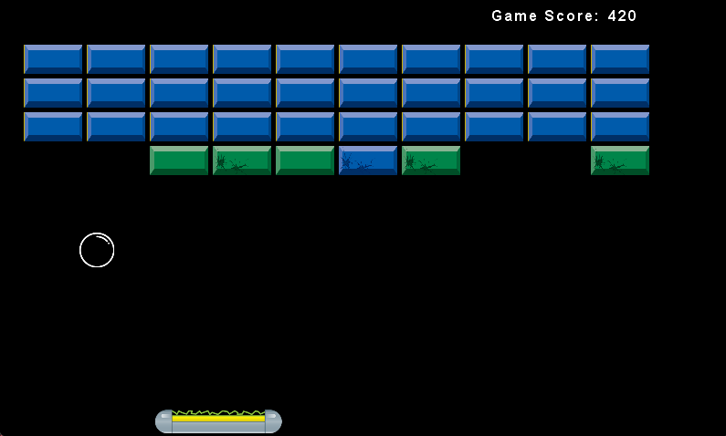
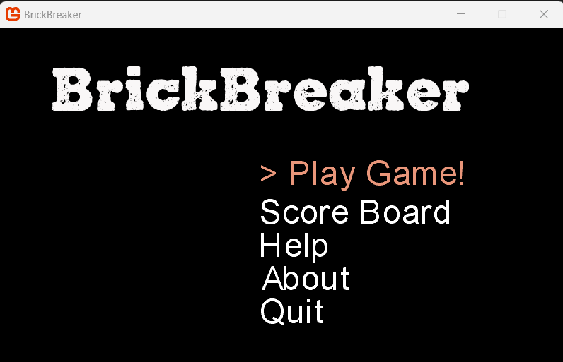
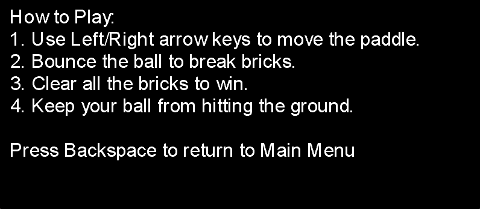
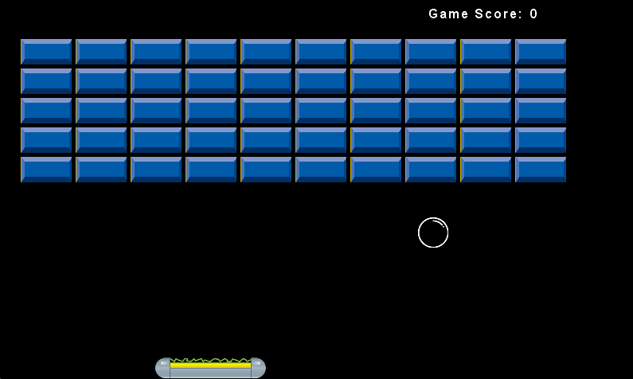
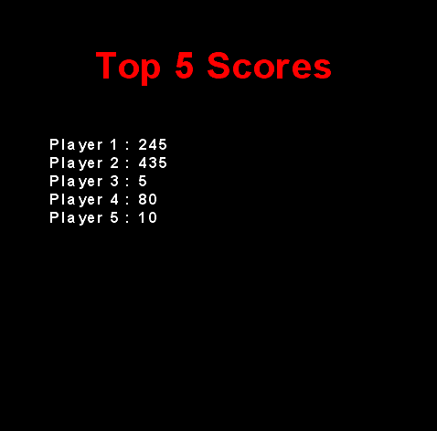
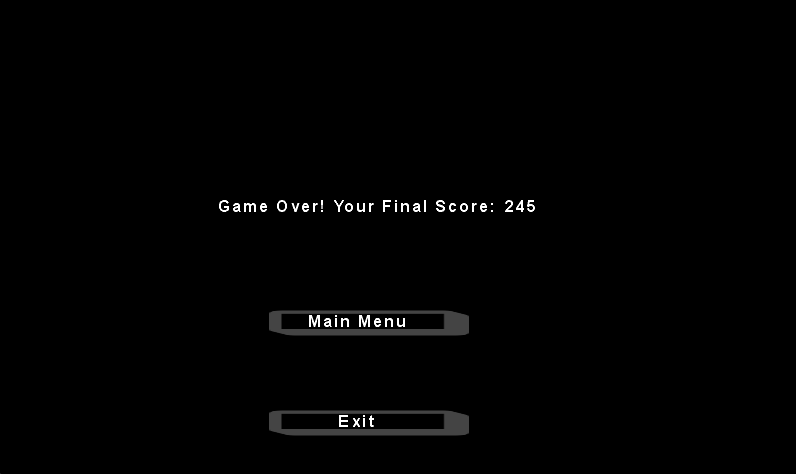

# BrickBreaker

BrickBreaker is a classic arcade-style game where players use a paddle to bounce a ball and break bricks. This modern version comes with a sleek interface, scoreboard, and downloadable release.



## Table of Contents

1. [Features](#features)
2. [Requirements](#requirements)
3. [Installation](#installation)
4. [Usage](#usage)
5. [Screenshots](#screenshots)
6. [Contributing](#contributing)
7. [License](#license)

## Features

- Engaging gameplay with paddle and ball mechanics
- Score tracking and a leaderboard for top scores
- Instructions and "How to Play" screen
- Dynamic game over screen with final score
- Sleek and intuitive user interface

## Requirements

- Windows OS
- .NET Framework 4.7.2 or higher
- Visual Studio 2017 or newer (recommended)

## Installation

1. Clone the repository:

   ```bash
   git clone https://github.com/liamc-code/BrickBreaker.git
   ```

2. Open the solution file `BrickBreaker.sln` in Visual Studio.

3. Build and run the application by pressing `F5` or selecting "Start Debugging" from the "Debug" menu.

4. Alternatively, download the latest release:

   - Visit the [Releases](https://github.com/liamc-code/BrickBreaker/releases) page in the GitHub repository.
   - Download the `.exe` file from the latest release.
   - Run the `.exe` file to launch the game without needing Visual Studio.

## Usage

1. **Main Menu**:
   - Navigate through options: Play Game, Scoreboard, Help, About, and Quit.

2. **Gameplay**:
   - Use the arrow keys to move the paddle.
   - Bounce the ball to break bricks and score points.
   - Avoid letting the ball fall off the screen.

3. **Help**:
   - View detailed instructions on how to play.

4. **Scoreboard**:
   - Check the top 5 player scores.

5. **Game Over**:
   - View your final score and return to the main menu or exit the game.

## Screenshots

### Main Menu


### Help Screen


### Play Screen - Initial


### Play Screen - In Progress


### Scoreboard


### Game Over


## License

BrickBreaker is released under the [MIT License](./LICENSE).
